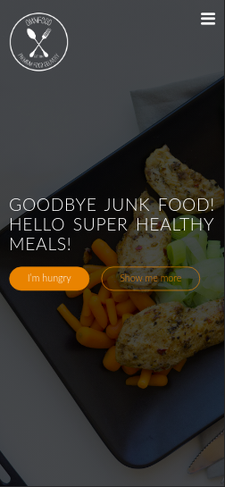
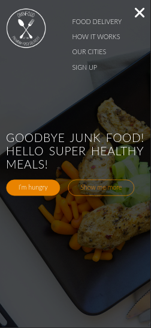

# HTML5 and CSS3 course content (Omnifood project)

<!-- TABLE OF CONTENTS -->
## TABLE OF CONTENTS

- [HTML5 and CSS3 course content (Omnifood project)](#html5-and-css3-course-content-omnifood-project)
  - [TABLE OF CONTENTS](#table-of-contents)
  - [ABOUT](#about)
    - [PREVIEW](#preview)
    - [DEMONSTRATION](#demonstration)

<!-- ABOUT THE PROJECT -->
## ABOUT

Content implemented during the course ["Build Responsive Real World Websites with HTML5 and CSS3"](https://www.udemy.com/course/design-and-develop-a-killer-website-with-html5-and-css3).

The course covers the following topics:

- HTML5;
- CSS3: Most commom CSS properties, basic animations, flexbox, grid;
- JQuery;
- Responsive web design with media queries;
- Google Analytics, basic Search Engine Optimization (SEO);
- Performance optimization (site speed to load).

### PREVIEW

**Webpage preview**

 

**Mobile preview**

 

### DEMONSTRATION

You can check the live demonstration at: <a href="https://tukno.github.io/omnifood/" target="_blank" >VIEW DEMO</a>

